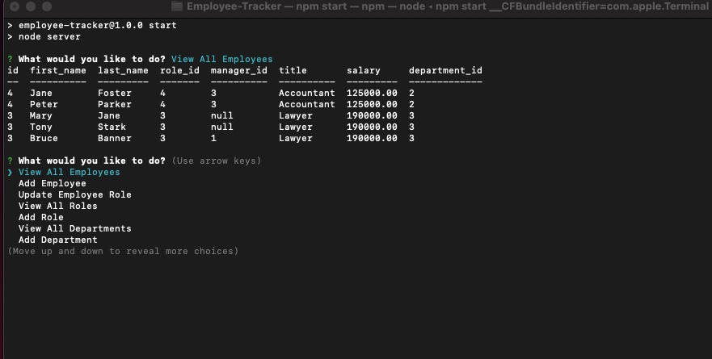
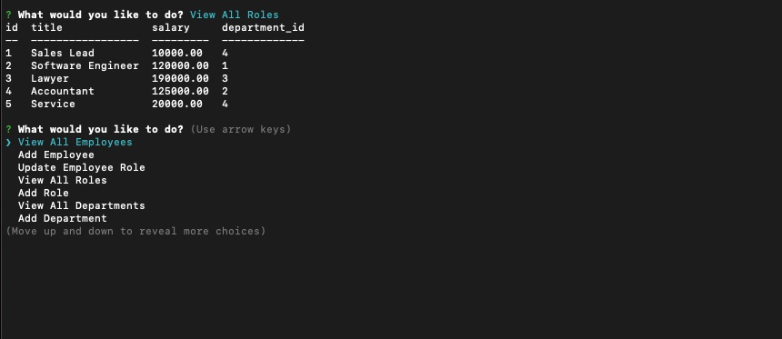
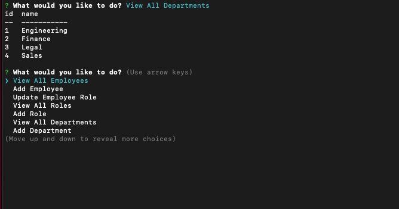

# Employee-Tracker

[Github URL](https://github.com/aescobar73/Employee-Tracker)

 

[Demo Video](https://drive.google.com/file/d/1sz3iI2zu-fuoybVYhmWRRwssYzJf3_5-/view)

 

 

## Table of Contents 

- [Installation](#installation)
- [Usage](#usage)
- [Contributions](#contributions)
- [Criteria](#Accepted-Criteria)
- [Test](#tests)
- [Question](#questions)

## Accepted Criteria
 

        GIVEN a note-taking application
        WHEN I open the Note Taker
        THEN I am presented with a landing page with a link to a notes page
        WHEN I click on the link to the notes page
        THEN I am presented with a page with existing notes listed in the left-hand column, plus empty fields to enter a new note title and the note’s text in the right-hand column
        WHEN I enter a new note title and the note’s text
        THEN a Save icon appears in the navigation at the top of the page
        WHEN I click on the Save icon
        THEN the new note I have entered is saved and appears in the left-hand column with the other existing notes
        WHEN I click on an existing note in the list in the left-hand column
        THEN that note appears in the right-hand column
        WHEN I click on the Write icon in the navigation at the top of the page
        THEN I am presented with empty fields to enter a new note title and the note’s text in the right-hand column
    

## Description

        The following Challenge requires us to make an Employee-Tracker using MySQL. We had to create databases, and update roles, employees,and departments.
        

 
 

## Contributions

 

 

## Initial Command Line

 

 

 

## Employees Listed

 

 

 

## Roles Table

 

 

## Departments Table

 

